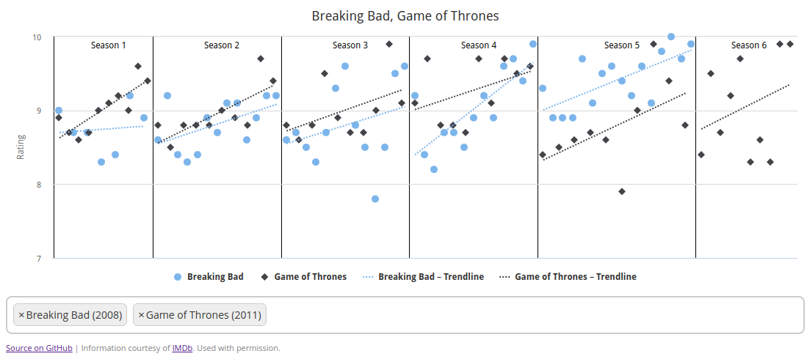

# tv-show-ratings



[Hosted Version](https://phiresky.github.io/tv-show-ratings/)

This project plots the episode ratings of TV shows and their trends.

To parse / convert the data:

```sh
yarn
cd parse-data-rs
./getdata.sh
cargo run --release
cd ..
yarn run ts-node --transpile-only src/seed
```

To run the project first run `yarn run proto-gen` then run `yarn run dev`.

To build the production version run `yarn run build`.
